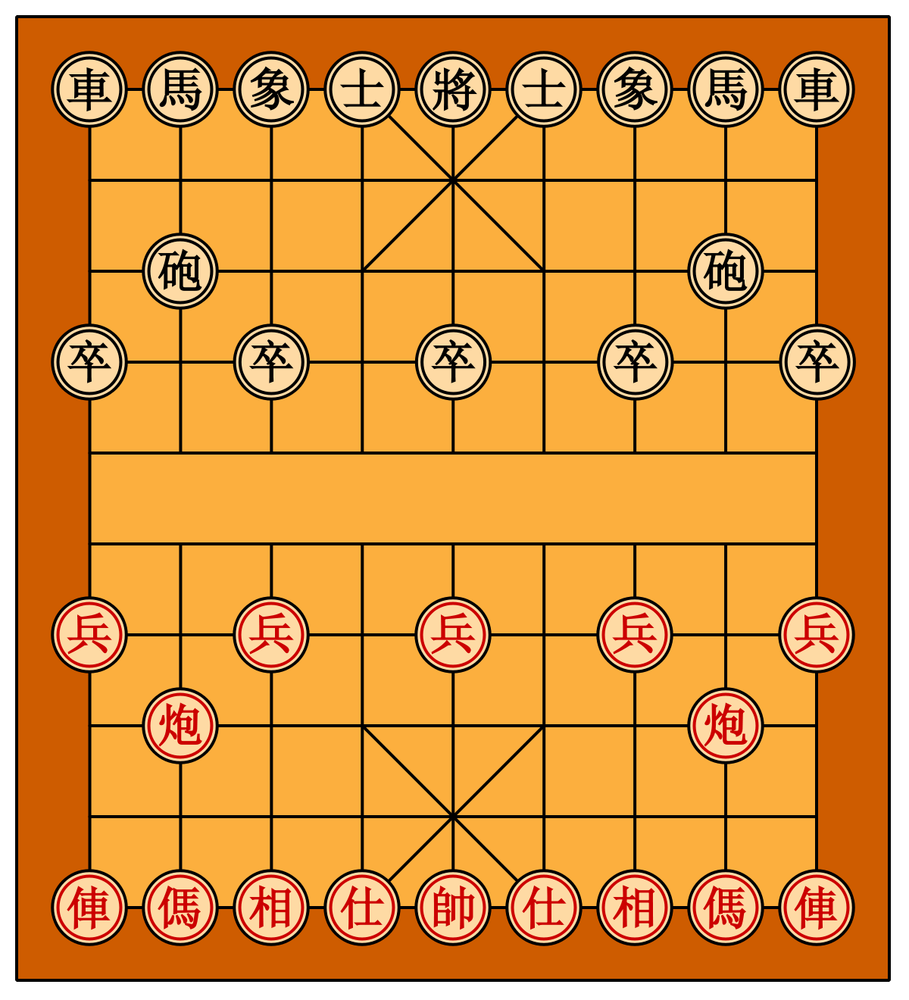

# About
Xiang Qi, also known as Chinese chess is a traditional game originated from China. Xiang Qi is similar in many respect to Chess, but is arguably more complicated. It has a higher branching factor, and each of the pieces has more restrictions as compared to Chess.

# Introduction to Xiang Qi
## The Board

This is how the Xiang Qi board looks like. The board has 9 columns and 10 rows, where the pieces are placed at the line intersections. There is a wide blank space in between the two sides which we will call it the river. There's also a 3x3 square box situated at the middle of each ends of the board, which we will call the palace. Like chess, you will either play as the red pieces or the black, and your opponent will be challenging you with the other color.

## The Rules
The game starts off with the position as shown in the image. Generally, the red pieces will get to move first. The game ends when either sides have no more moves to save the general piece from being taken in the next move, similar to checkmating the king in chess. 

When a player make a move which puts the enemy general in danger of being capture in the next move, that is called a check. Unlike chess, perpetual checking of the enemy king results not in stalemate, but disqualification of the player making the perpetual check. Specifically, the same piece cannot be used to check the enemy general in the same position for more than 3 times in a row.

There is also a rule where perpetually chasing a piece is not allowed. In our implementation, this is not added as we believe that stopping the process of perpetually chasing a piece should be a part of the strategy.

## The Pieces
Each player starts off with 1 general, 2 advisors, 2 elephants, 2 horses, 2 chariots, 2 cannons and 5 soldiers.

### The General
The general lives in the palace, and can only move within the palace. The general can move orthogonally 1 position, which means that it can only move forward, backward, left or right by 1 position. The general can be used to capture a piece as it moves, unless capturing a piece puts the general in check.

A special rule called the "flying general" applies to the general, where if the two generals from opposing side faces each other in an open (no pieces blocking) vertical column, the general can "fly" and capture the opponent's general. Since a general will occupy an open vertical column first, the opponent will not be able to move their general into the open column since that will be a movement into check. However, this rule can be used to checkmate an opponent's general.

### The Advisor
Similar to the general, the advisor can only move within the palace. In contrast to the general, the advisor can only move diagonally, which means that there are only 5 possible positions that each advisor can take. The advisor can be used to capture a piece as it moves.

### The Elephant
The elephant moves exactly 2 steps diagonally, which can also be visualized as two positions to the left/right and two positions forward/backward. The elephant will not be able to jump over pieces while moving, meaning if a piece exists to the top right of the elephant, it will not be able to jump over that piece to reach the top right position of the piece.

The elephant can be used to a piece as it moves. The elephant cannot cross the river, which is why it is mainly used as a defensive piece.

### The Horse
The horse in Xiang Qi behaves similarly to knight in chess, where it moves following the "L" shape, which can be visualized as moving 1 position orthogonally followed by 1 position diagonally away from the horse. The horse can be used to capture a piece as it moves.

In addition to the rules in chess, the horse in Xiang Qi can be blocked when a piece is placed orthogonally to the horse. The moves that are blocked by a specific piece can be visualized as whichever moves which will touch a piece when making the "first" orthogonal move. For example, when a piece is placed in the forward position of a horse, the horse will not be able to make the following 2 moves: horse lands at 2 position forward and 1 position to the right, and 2 position forward and 1 position to the left. However, other moves will still be available for the horse.

### The Chariot
The chariot in Xiang Qi behaves exactly like rook in chess, where it can move orthogonally for however many positions without skipping over a piece. The chariot can be used to capture a piece as it moves.

### The Cannon
The cannon is the only piece in the game where its movement and capturing pattern is different. The movement of the cannon is similar to the chariot, where it can move orthogonally for however many positions without skipping over a piece.

Unlike the chariot, the cannon must capture a piece by skipping over another piece. There can be be any number of blank positions that exists between the cannon to the piece that it is skipping over, and from the piece that it is skipping over to the piece being captures.

### The Soldier
The soldier changes its movement depending whether is has crossed the river or not. Before crossing the river, the soldier has only 1 possible move - moving forward. After crossing the river, the soldier will have 3 possible moves - moving forward, moving left, and moving right. Do note that soldiers are not able to move backward. The soldier can be used to capture a piece as it moves.

Unlike chess, nothing special happens once the soldier reaches the last row of the enemy territory. Upon reaching the last row, the soldier's possible moves reduces to moving left or moving right.

# Installation
First, clone the repository - `git clone https://github.com/tanliyon/gym-xiangqi.git`

Enter the repository - `cd gym-xiangqi`

Install the core dependencies - `pip3 install -e .`

(optional) Install the ddependencies for development - `pip3 install -r requirements.txt`

# Software Handbook
Read through the [software handbook](https://docs.google.com/document/d/1Y5AM-Xj4XUkurKW1m9cBOs0bRJWS62qw8wu74Alcj9k/edit?usp=sharing) for comprehensive explaination and development guide for the repository.

