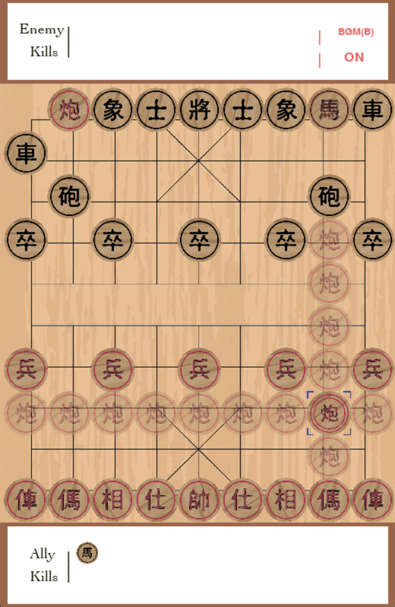

GUI
===

Users can observe the training and game progress using our PyGame GUI.
In this page, we will describe some of the features of our GUI.

Our Xiangqi environment renders current game state with PyGame upon calling
the environment object's :code:`render()` method.

The Board and Pieces
--------------------
The rendered GUI contains the board and pieces. The piece colors are red and
black with the ally side always rendered on the bottom side of the board and
the enemy side on the top side of the board. Note that users have the choice
to choose the ally's and enemy's colors when initializing the environment. For
a detailed example of initializing and running the environment, take a look at
the :doc:`examples` section.

During game mode, the GUI interacts with users by observing user mouse clicks.
Upon piece selection, the GUI will highlight the possible places on the board
that the current selected piece can move to. If you are interested in learning
how each piece moves, please read more about the basic
rules on our `Github Wiki page <https://github.com/tanliyon/gym-xiangqi/wiki>`_
for a starting place.

Captured Log
------------
Upon success capture of an enemy piece, the captured piece will be displayed in
the captured log section of the GUI.

Sound Effects
-------------
There are two sound effects added to the GUI.

1. The background game music
2. Piece move sound effect

If you are tired of listening to the background music every time the GUI opens,
just hit the 'b' on your keyboard to toggle the music on and off.
